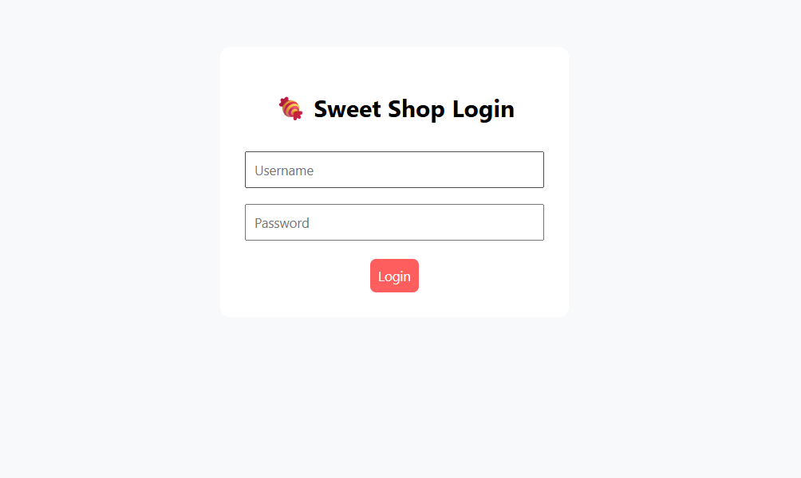
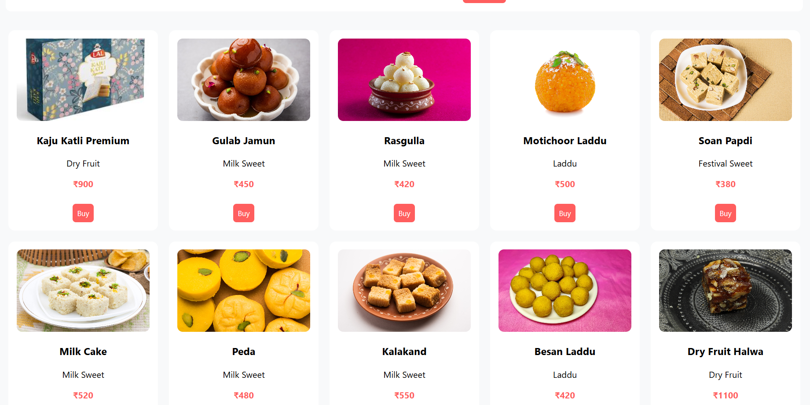
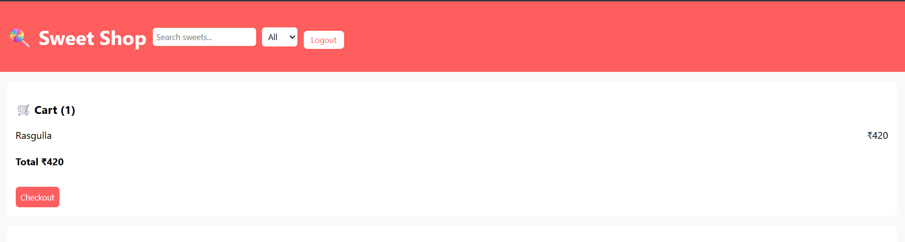
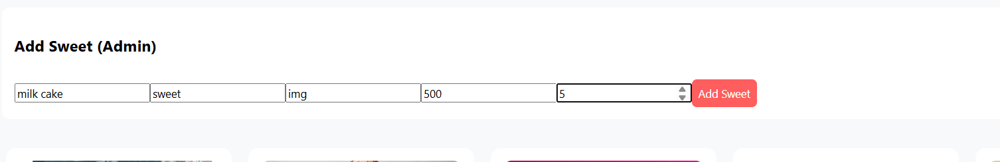

# 🍬 Sweet Shop Management System

A full-stack web application to manage a sweet shop, allowing users to browse and purchase sweets while enabling admins to manage inventory.

📌 Features

👤 User
- User login using JWT authentication
- View available sweets with images, price, and category
- Buy sweets (quantity decreases automatically)
- Search sweets by name
- Filter sweets by category
- Add sweets to cart

👑 Admin
- Secure admin login
- Add new sweets
- Delete sweets
- Manage stock quantity
- View all sweets

🛠 Tech Stack

Frontend
- React (Vite)
- TypeScript
- Axios
- CSS (Custom UI)
- JWT Decode

Backend
- Node.js
- Express.js
- TypeScript
- Prisma ORM
- PostgreSQL
- JWT Authentication

🗄 Database Schema

### Sweet Table
| Field      | Type     |
|-----------|----------|
| id        | Int      |
| name      | String   |
| category  | String   |
| price     | Int      |
| quantity  | Int      |
| imageUrl  | String   |

🚀 Project Setup

  🔧 Backend Setup
       bash
       cd sweet-shop-backend
       npm install
       npx prisma migrate dev
       npm run dev
  
Create .env file:

DATABASE_URL=your_postgres_url
JWT_SECRET=<your_secret_key>
PORT=4000

   🎨 Frontend Setup
     cd sweet-shop-frontend
     npm install
     npm run dev

     Create .env file:

VITE_API_URL=http://localhost:4000

🌐 API Endpoints
   Auth
    POST /api/auth/login

   Sweets
    GET /api/sweets
    POST /api/sweets (Admin)
    POST/api/sweets/:id/purchase
    DELETE /api/sweets/:id (Admin)

🔐 Authentication

JWT-based authentication
Role-based access control (Admin/User)
Protected routes on backend

☁ Deployment

Frontend: Vercel

Backend: Render

Database: Render PostgreSQL

👤 Author

Shivam Dhakrey

📸 Screenshots

🔐 Login Page

🍭 Sweet List

🛒 Cart Page

👑 admin add Page

